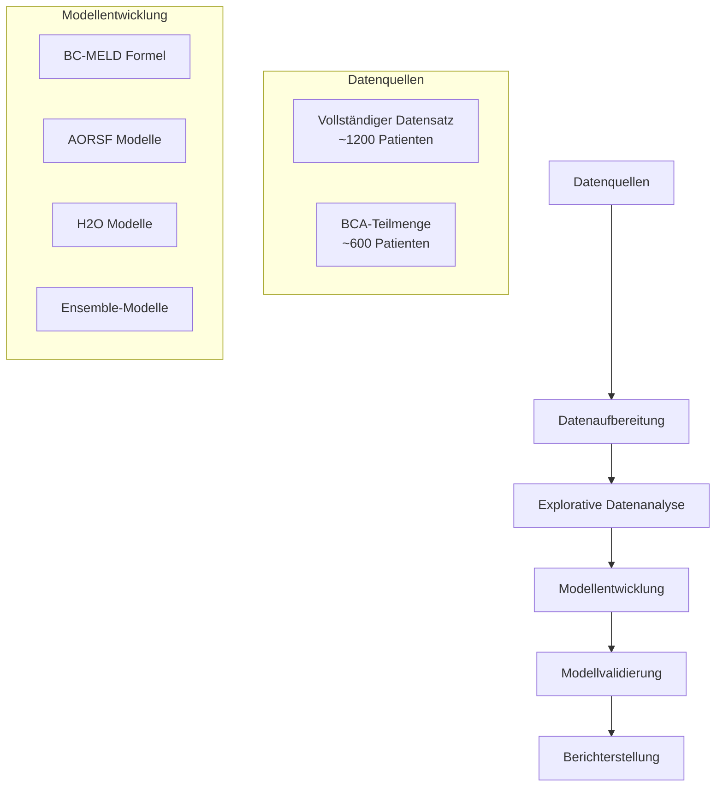
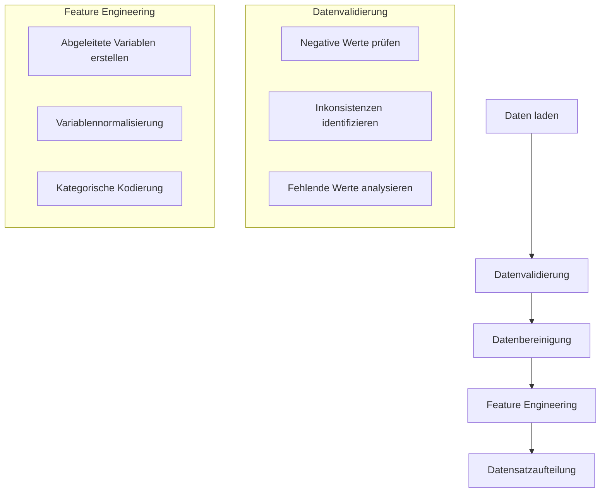
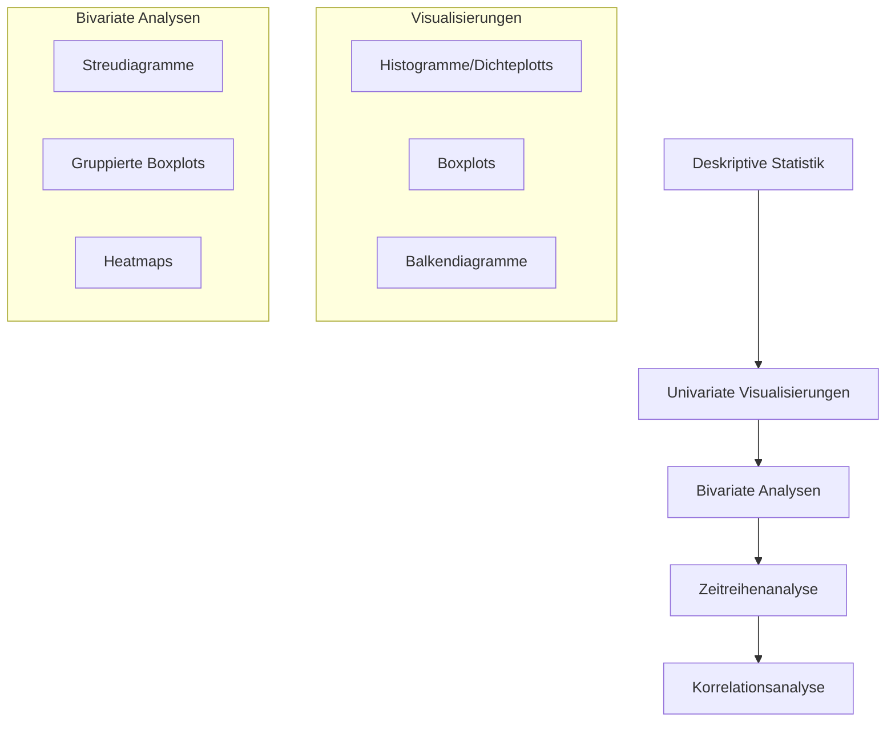
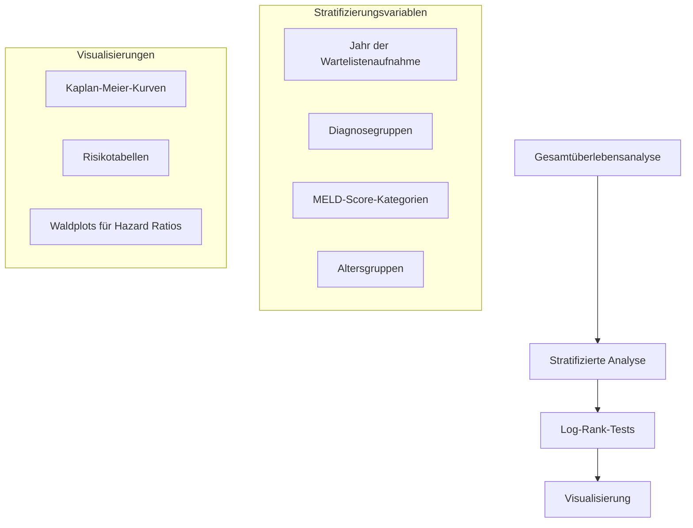
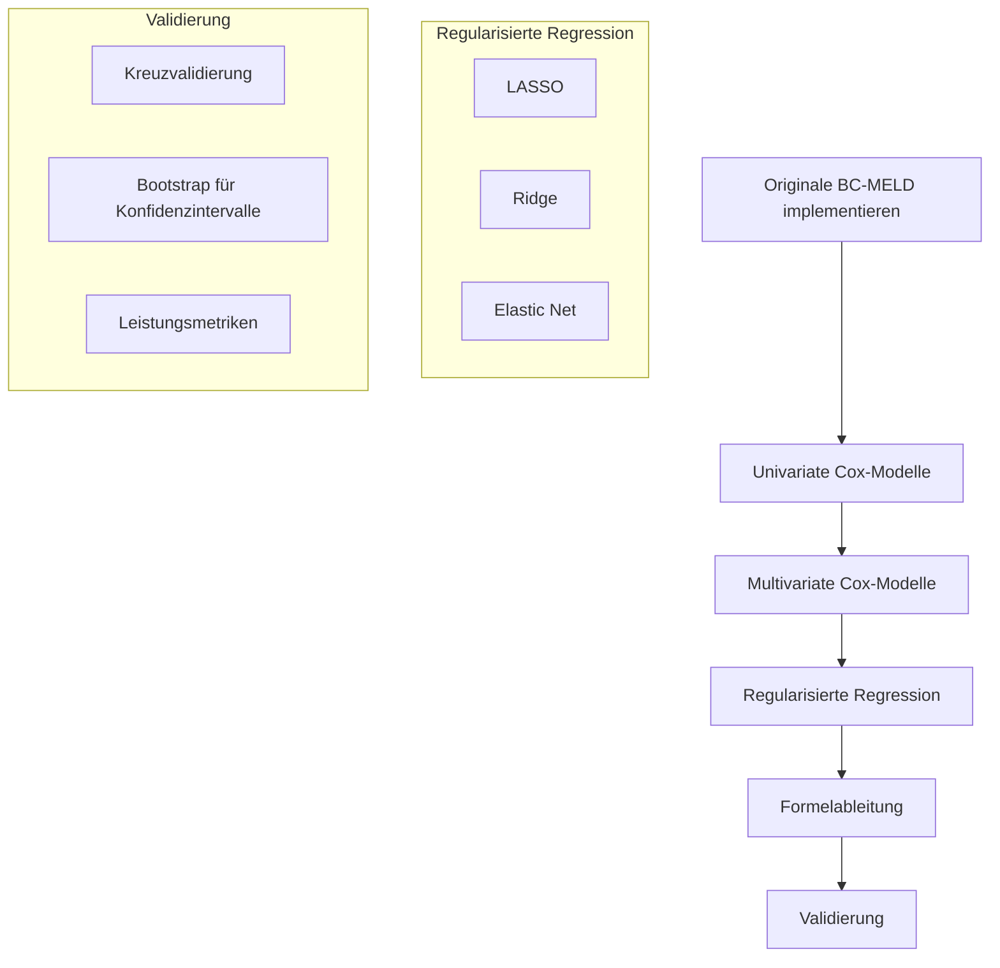
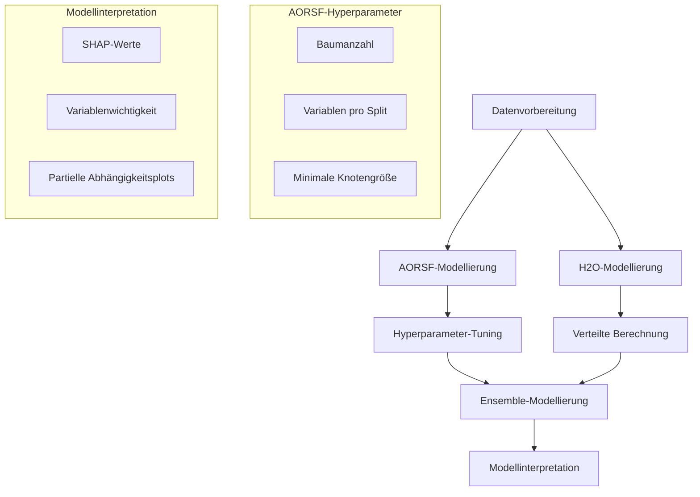
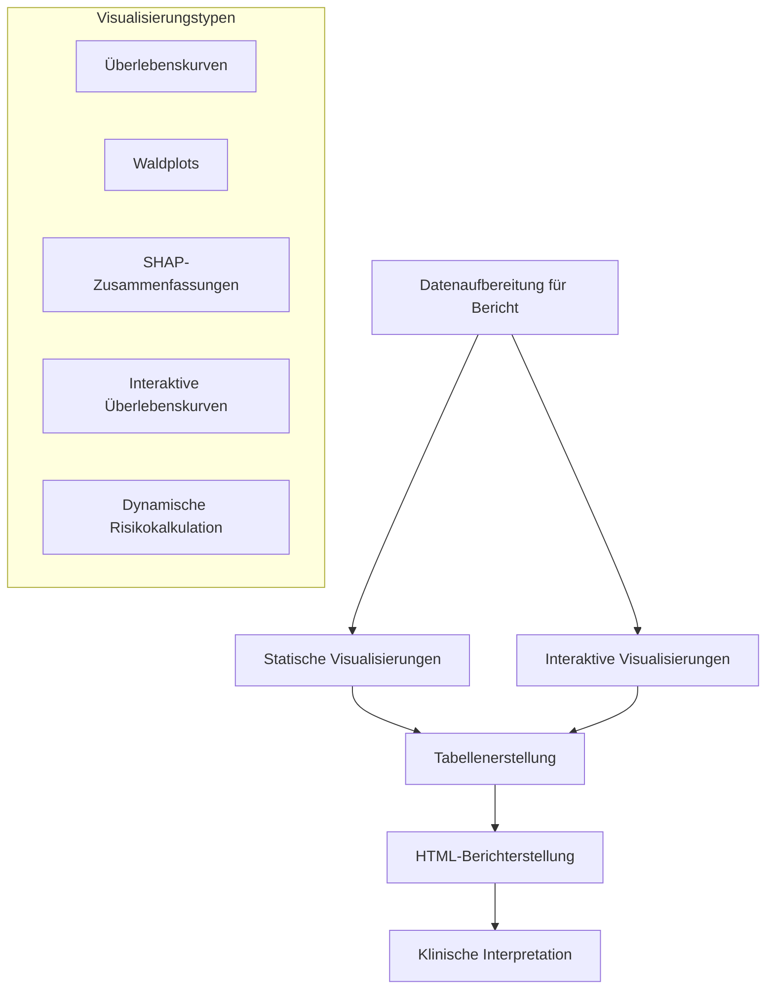
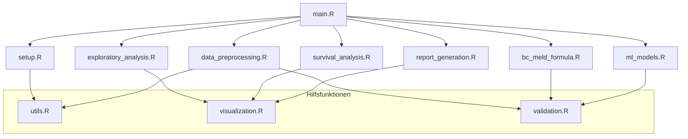

# Architekturplan: Verbessertes Überlebensvorhersagemodell für Lebertransplantations-Wartelisten

## 1. Systemübersicht

## 2. Technische Anforderungen

### 2.1 Systemanforderungen
- **Flexibilität**: Code muss auf verschiedenen Systemen lauffähig sein
- **Skalierbarkeit**: Anpassungsfähig an verfügbare Ressourcen (RAM, CPU-Kerne)
- **Reproduzierbarkeit**: Feste Random Seeds, dokumentierte Abhängigkeiten

### 2.2 Softwareanforderungen
- **R-Version**: ≥ 4.2.0
- **Kernpakete**: 
  - Datenverarbeitung: tidyverse, data.table
  - Überlebensanalyse: survival, survminer
  - Maschinelles Lernen: AORSF, h2o
  - Visualisierung: ggplot2, plotly
  - Berichterstellung: rmarkdown, knitr, flexdashboard

### 2.3 Leistungsanforderungen
- **Validierungsmetriken**: Brier Score, C-Index, R²
- **Kreuzvalidierung**: Verschachtelte Kreuzvalidierung für Modellauswahl
- **Konfidenzintervalle**: Bootstrap oder Monte-Carlo-Methoden

## 3. Detaillierter Implementierungsplan

### 3.1 Datenaufbereitung und -validierung

#### Implementierungsdetails:
- **Flexibler Datenpfad-Mechanismus**: Relativer und absoluter Pfad unterstützt
- **Validierungsfunktionen**: Automatisierte Prüfungen für Datenqualität
- **Fehlende Werte**: Multiple Imputation mit mice-Paket
- **Feature Engineering**: 
  - Verhältnisse zwischen Körperzusammensetzungsvariablen
  - Normalisierung nach Körpergröße/Gewicht
  - Interaktionsterme für klinisch relevante Variablen

### 3.2 Explorative Datenanalyse

#### Implementierungsdetails:
- **Visualisierungsframework**: Modulares Design mit einheitlichem Theming
- **Publikationsqualität**: Hohe Auflösung, konsistente Farbpaletten, lesbare Schriftgrößen
- **Interaktive Optionen**: HTML-Widgets für interaktive Exploration
- **Automatisierte Berichterstellung**: Zusammenfassung der EDA in HTML-Format

### 3.3 Kaplan-Meier-Überlebensanalyse

#### Implementierungsdetails:
- **Zeitpunkte**: Analyse für 3, 6, 12, 36 und 60 Monate
- **Stratifizierung**: Dynamische Stratifizierungsfunktion für verschiedene Variablen
- **Visualisierung**: Publikationsreife KM-Kurven mit Risikotabellen
- **Statistische Tests**: Log-Rank-Tests mit p-Wert-Adjustierung für multiples Testen

### 3.4 BC-MELD-Formelentwicklung

#### Implementierungsdetails:
- **Proportionale Hazards-Annahme**: Schoenfeld-Residuen-Tests
- **Variablenauswahl**: Elastic Net mit optimiertem Alpha-Parameter
- **Kreuzvalidierung**: 10-fache Kreuzvalidierung für Hyperparameter-Optimierung
- **Konfidenzintervalle**: 1000 Bootstrap-Stichproben für Koeffizientenschätzungen
- **Vergleichsmetriken**: Brier-Score, C-Index und R² zu verschiedenen Zeitpunkten

### 3.5 Fortgeschrittene ML-Überlebensmodelle

#### Implementierungsdetails:
- **AORSF-Konfiguration**: 
  - Ressourcenadaptive Implementierung (Anzahl der Threads basierend auf verfügbaren Kernen)
  - Hyperparameter-Grid mit 5-facher Kreuzvalidierung
  
- **H2O-Konfiguration**:
  - Dynamische Speicherzuweisung basierend auf verfügbarem RAM
  - Automatische Erkennung und Nutzung verfügbarer Kerne
  - Frühzeitiges Stoppen zur Vermeidung von Überanpassung
  
- **Ensemble-Methodik**:
  - Gewichtete Kombination von Modellvorhersagen
  - Optimierung der Gewichte durch Stacked Regression
  - Kreuzvalidierte Ensemble-Leistung
  
- **Interpretationsmethoden**:
  - SHAP-Werte für lokale und globale Interpretation
  - Variablenwichtigkeitsplots mit Konfidenzintervallen
  - Partielle Abhängigkeitsplots für Schlüsselvariablen

### 3.6 Berichterstellung und Visualisierung

#### Implementierungsdetails:
- **Berichtsstruktur**: Modularer R Markdown-Bericht mit parametrisierten Abschnitten
- **Visualisierungsframework**: 
  - Einheitliches Theming für alle Grafiken
  - Hohe Auflösung für Publikationen (600 dpi)
  - Konsistente Farbpaletten (viridis für kontinuierliche, ColorBrewer für kategoriale Variablen)
  
- **Interaktive Elemente**:
  - Plotly für interaktive Überlebenskurven
  - DT für durchsuchbare/filterbare Tabellen
  - Shiny-Elemente für dynamische Risikokalkulation
  
- **Klinische Interpretation**:
  - Automatisierte Textgenerierung für Schlüsselergebnisse
  - Vergleichstabellen mit farblicher Hervorhebung signifikanter Unterschiede
  - Nomogramme für klinische Anwendung

## 4. Modulare Codestruktur

### 4.1 Hauptmodule

- **setup.R**: Umgebungseinrichtung, Paketladung, Konfiguration
- **data_preprocessing.R**: Datenladung, -validierung und -aufbereitung
- **exploratory_analysis.R**: Deskriptive Statistik und Visualisierungen
- **survival_analysis.R**: Kaplan-Meier und Cox-Modelle
- **bc_meld_formula.R**: BC-MELD-Implementierung und -Verbesserung
- **ml_models.R**: AORSF, H2O und Ensemble-Modelle
- **report_generation.R**: HTML-Berichterstellung

### 4.2 Hilfsfunktionen

- **utils.R**: Allgemeine Hilfsfunktionen, Datenmanipulation
- **visualization.R**: Visualisierungsfunktionen mit einheitlichem Theming
- **validation.R**: Kreuzvalidierung, Leistungsmetriken, Bootstrapping

## 5. Implementierungsplan

### Phase 1: Grundlegende Infrastruktur (Woche 1)
- Umgebungseinrichtung und Paketinstallation
- Datenladung und -validierung
- Explorative Datenanalyse
- Grundlegende Überlebensanalyse

### Phase 2: BC-MELD-Entwicklung (Woche 2)
- Implementierung der originalen BC-MELD-Formel
- Cox-Modellierung für Körperzusammensetzungsvariablen
- Regularisierte Regression für Koeffizientenableitung
- Validierung der verbesserten Formel

### Phase 3: ML-Modellentwicklung (Woche 3)
- AORSF-Implementierung und Hyperparameter-Tuning
- H2O-Modellierung und verteilte Berechnung
- Ensemble-Modellentwicklung
- Modellinterpretation und SHAP-Analyse

### Phase 4: Berichterstellung und Finalisierung (Woche 4)
- Visualisierungserstellung und -optimierung
- HTML-Berichterstellung
- Klinische Interpretation
- Dokumentation und Code-Bereinigung

## 6. Risiken und Abhilfemaßnahmen

| Risiko | Wahrscheinlichkeit | Auswirkung | Abhilfemaßnahme |
|--------|-------------------|------------|-----------------|
| Unzureichende Rechenressourcen für H2O | Mittel | Hoch | Ressourcenadaptive Implementierung, Fallback auf leichtgewichtige Modelle |
| Verletzung der proportionalen Hazards-Annahme | Hoch | Mittel | Stratifizierte Modelle, zeitabhängige Kovariaten |
| Überanpassung der ML-Modelle | Mittel | Hoch | Rigorose Kreuzvalidierung, Regularisierung, Ensemble-Methoden |
| Fehlende Werte in BCA-Variablen | Hoch | Mittel | Multiple Imputation, Sensitivitätsanalyse |
| Heterogene Systemumgebungen | Mittel | Niedrig | Containerisierung oder umgebungsunabhängige Implementierung |

## 7. Qualitätssicherung

- **Codequalität**: Einheitlicher Codierungsstil, umfassende Dokumentation
- **Reproduzierbarkeit**: Feste Random Seeds, versionierte Abhängigkeiten
- **Validierung**: Kreuzvalidierung, externe Validierung wenn möglich
- **Fehlerbehandlung**: Robuste Fehlerbehandlung und Logging
- **Leistungsüberwachung**: Benchmarking und Profilierung für Ressourcenoptimierung

## 8. Liefergegenstände

1. **R-Skripte**: Vollständige, kommentierte R-Skripte für alle Analysen
2. **HTML-Bericht**: Umfassender Bericht mit eingebetteten Visualisierungen
3. **Visualisierungen**: Publikationsreife Grafiken in verschiedenen Formaten
4. **Dokumentation**: Technische Dokumentation und Benutzerhandbuch
5. **Modelle**: Gespeicherte Modellobjekte für zukünftige Anwendungen

## 9. Zusammenfassung

Dieser Architekturplan bietet einen umfassenden Rahmen für die Entwicklung eines verbesserten Überlebensvorhersagemodells für Patienten auf der Lebertransplantations-Warteliste. Der Plan integriert traditionelle statistische Methoden mit fortschrittlichen maschinellen Lernansätzen und legt besonderen Wert auf Flexibilität, Reproduzierbarkeit und klinische Interpretierbarkeit. Die modulare Struktur ermöglicht eine effiziente Implementierung und einfache Wartung, während die adaptiven Ressourcenmechanismen die Ausführung auf verschiedenen Systemen gewährleisten.