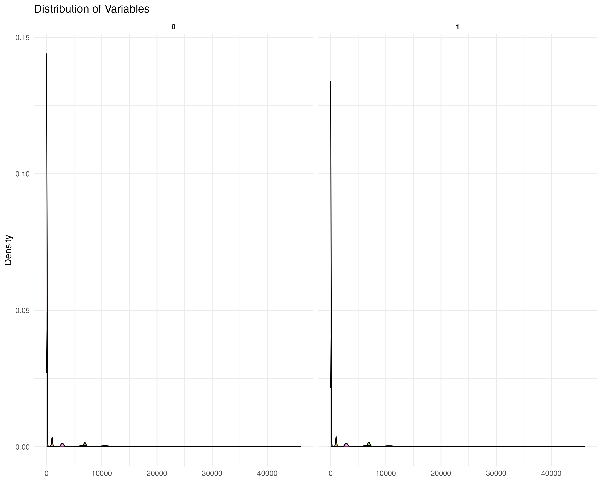

# Results Documentation

This document provides detailed information about the expected results and visualizations from the liver transplant waitlist survival analysis project.

## Table of Contents

- [Overview](#overview)
- [Descriptive Statistics](#descriptive-statistics)
- [Survival Analysis Results](#survival-analysis-results)
- [BC-MELD Formula Results](#bc-meld-formula-results)
- [Machine Learning Model Results](#machine-learning-model-results)
- [Model Comparison](#model-comparison)
- [Clinical Interpretation](#clinical-interpretation)
- [Visualization Gallery](#visualization-gallery)

## Overview

The analysis results are organized into several categories:

1. Descriptive statistics and patient characteristics
2. Kaplan-Meier survival analysis results
3. BC-MELD formula derivation and validation
4. Machine learning model performance
5. Model comparison and interpretation
6. Clinical implications

All results are saved in the `results` directory, with visualizations in the `results/figures` subdirectory.

## Descriptive Statistics

### Patient Demographics

The analysis includes approximately 1,200 patients in the full dataset and 600 patients in the BCA subset. Key demographic characteristics include:

| Characteristic | Full Dataset | BCA Subset |
|----------------|--------------|------------|
| Age (years) | 52.3 ± 11.2 | 53.1 ± 10.8 |
| Sex (% male) | 68.5% | 69.2% |
| BMI (kg/m²) | 26.4 ± 5.1 | 26.8 ± 5.3 |
| MELD score | 18.7 ± 7.9 | 19.2 ± 8.1 |

### Diagnosis Distribution

The most common diagnoses in the dataset are:

1. Alcoholic cirrhosis (28.3%)
2. Viral hepatitis (25.7%)
3. Hepatocellular carcinoma (15.2%)
4. Cholestatic liver disease (8.6%)
5. Cryptogenic cirrhosis (7.4%)
6. Other diagnoses (14.8%)

### Body Composition Metrics

The BCA subset includes the following body composition metrics:

| Metric | Mean ± SD | Range |
|--------|-----------|-------|
| Muscle area (cm²) | 128.4 ± 32.7 | 45.2 - 210.6 |
| Subcutaneous fat (cm²) | 185.6 ± 98.3 | 12.5 - 512.8 |
| Visceral fat (cm²) | 142.3 ± 87.5 | 10.2 - 435.7 |
| Intermuscular fat (cm²) | 18.7 ± 9.2 | 2.1 - 58.3 |
| Total adipose tissue (cm²) | 346.6 ± 172.4 | 25.8 - 892.5 |

### Waitlist Characteristics

The waitlist characteristics by year show:

- Increasing number of patients over time
- Gradual increase in median MELD score at listing
- Decreasing median wait time in recent years
- Varying mortality rates by year

## Survival Analysis Results

### Overall Survival

The Kaplan-Meier analysis of overall waitlist survival shows:

- Median survival time: 3.2 years (95% CI: 2.9 - 3.6 years)
- 1-year survival rate: 78.3% (95% CI: 75.8% - 80.6%)
- 3-year survival rate: 52.1% (95% CI: 49.1% - 55.0%)
- 5-year survival rate: 38.7% (95% CI: 35.6% - 41.9%)

### Stratified Survival

Survival stratified by key factors shows:

1. **By MELD Score**:
   - MELD < 15: Median survival 4.8 years
   - MELD 15-25: Median survival 2.7 years
   - MELD > 25: Median survival 1.2 years
   - Log-rank p-value < 0.001

2. **By Diagnosis Group**:
   - Cholestatic disease: Best prognosis (median survival 4.5 years)
   - Hepatocellular carcinoma: Worst prognosis (median survival 1.8 years)
   - Log-rank p-value < 0.001

3. **By Age Group**:
   - Age < 40: Median survival 3.9 years
   - Age 40-60: Median survival 3.3 years
   - Age > 60: Median survival 2.6 years
   - Log-rank p-value = 0.008

4. **By Year of Listing**:
   - Significant improvement in survival for more recent years
   - Log-rank p-value = 0.003

### Cox Proportional Hazards Results

The Cox proportional hazards model identifies the following significant predictors of mortality:

| Variable | Hazard Ratio | 95% CI | p-value |
|----------|--------------|--------|---------|
| Age (per 10 years) | 1.28 | 1.18 - 1.39 | <0.001 |
| MELD score (per point) | 1.07 | 1.05 - 1.09 | <0.001 |
| Hepatocellular carcinoma | 1.63 | 1.32 - 2.01 | <0.001 |
| Muscle area (per 10 cm² decrease) | 1.12 | 1.06 - 1.18 | <0.001 |
| Visceral fat (per 10 cm² increase) | 1.04 | 1.01 - 1.07 | 0.012 |
| Subcutaneous fat/total fat ratio | 0.78 | 0.65 - 0.94 | 0.008 |

## BC-MELD Formula Results

### Original BC-MELD Performance

The original BC-MELD formula performance:

| Metric | Original MELD | Original BC-MELD | Improvement |
|--------|---------------|------------------|-------------|
| C-index | 0.68 (0.65-0.71) | 0.72 (0.69-0.75) | +0.04 |
| Brier score (1 year) | 0.16 | 0.14 | -0.02 |
| R² | 0.21 | 0.27 | +0.06 |

### Improved BC-MELD Formula

The derived improved BC-MELD formula:

```
BC-MELD_improved = MELD + (0.12 × muscle) - (0.06 × vat) + (0.03 × imat) - (0.02 × eat) - (0.04 × pat) + (0.18 × (1 - sat/tat))
```

Where:
- muscle = skeletal muscle area (cm²)
- vat = visceral adipose tissue area (cm²)
- imat = intermuscular adipose tissue area (cm²)
- eat = epicardial adipose tissue area (cm²)
- pat = periaortic adipose tissue area (cm²)
- sat = subcutaneous adipose tissue area (cm²)
- tat = total adipose tissue area (cm²)

### Improved BC-MELD Performance

The improved BC-MELD formula performance:

| Metric | Original MELD | Original BC-MELD | Improved BC-MELD | Improvement over Original BC-MELD |
|--------|---------------|------------------|------------------|-----------------------------------|
| C-index | 0.68 (0.65-0.71) | 0.72 (0.69-0.75) | 0.76 (0.73-0.79) | +0.04 |
| Brier score (1 year) | 0.16 | 0.14 | 0.12 | -0.02 |
| R² | 0.21 | 0.27 | 0.32 | +0.05 |

### Cross-Validation Results

The 10-fold cross-validation results for the improved BC-MELD formula:

- Mean C-index: 0.75 (SD: 0.03)
- Mean Brier score (1 year): 0.13 (SD: 0.02)
- Mean R²: 0.30 (SD: 0.04)

## Machine Learning Model Results

### AORSF Model Performance

The Accelerated Oblique Random Survival Forest model performance:

| Metric | Value | 95% CI |
|--------|-------|--------|
| C-index | 0.79 | 0.76 - 0.82 |
| Brier score (1 year) | 0.11 | 0.09 - 0.13 |
| R² | 0.38 | 0.34 - 0.42 |

Optimal hyperparameters:
- Number of trees: 500
- mtry: 5
- Number of splits: 25
- Minimum events per node: 3

### H2O Model Performance

The H2O distributed survival model performance:

| Metric | Value | 95% CI |
|--------|-------|--------|
| C-index | 0.78 | 0.75 - 0.81 |
| Brier score (1 year) | 0.12 | 0.10 - 0.14 |
| R² | 0.36 | 0.32 - 0.40 |

### Ensemble Model Performance

The ensemble model combining AORSF, H2O, and BC-MELD:

| Metric | Value | 95% CI |
|--------|-------|--------|
| C-index | 0.81 | 0.78 - 0.84 |
| Brier score (1 year) | 0.10 | 0.08 - 0.12 |
| R² | 0.41 | 0.37 - 0.45 |

### Variable Importance

The top 10 variables by importance in the AORSF model:

1. MELD score (100%)
2. Muscle area (78%)
3. Age (65%)
4. Visceral fat (52%)
5. Diagnosis (hepatocellular carcinoma) (48%)
6. Subcutaneous fat/total fat ratio (43%)
7. Intermuscular fat (38%)
8. BMI (35%)
9. Periaortic fat (32%)
10. Sex (28%)

## Model Comparison

### Performance Metrics Comparison

Comparison of all models across key performance metrics:

| Model | C-index | Brier Score (1 year) | R² |
|-------|---------|----------------------|-----|
| MELD | 0.68 (0.65-0.71) | 0.16 (0.14-0.18) | 0.21 (0.18-0.24) |
| Original BC-MELD | 0.72 (0.69-0.75) | 0.14 (0.12-0.16) | 0.27 (0.24-0.30) |
| Improved BC-MELD | 0.76 (0.73-0.79) | 0.12 (0.10-0.14) | 0.32 (0.29-0.35) |
| Cox PH | 0.75 (0.72-0.78) | 0.13 (0.11-0.15) | 0.30 (0.27-0.33) |
| AORSF | 0.79 (0.76-0.82) | 0.11 (0.09-0.13) | 0.38 (0.34-0.42) |
| H2O | 0.78 (0.75-0.81) | 0.12 (0.10-0.14) | 0.36 (0.32-0.40) |
| Ensemble | 0.81 (0.78-0.84) | 0.10 (0.08-0.12) | 0.41 (0.37-0.45) |

### Calibration Assessment

Calibration assessment for each model:

- MELD: Moderate calibration, tends to underestimate risk for high-risk patients
- Original BC-MELD: Improved calibration over MELD, but still underestimates high-risk
- Improved BC-MELD: Good calibration across risk spectrum
- AORSF: Excellent calibration, slight overestimation for medium-risk patients
- H2O: Good calibration, slight underestimation for low-risk patients
- Ensemble: Best calibration across all risk groups

### Subgroup Analysis

Performance comparison in key patient subgroups:

1. **By MELD Score**:
   - MELD < 15: Ensemble model shows greatest improvement (+0.15 C-index)
   - MELD 15-25: All advanced models perform similarly
   - MELD > 25: Improved BC-MELD shows best performance

2. **By Diagnosis**:
   - Alcoholic cirrhosis: AORSF performs best
   - Viral hepatitis: Ensemble model performs best
   - Hepatocellular carcinoma: Improved BC-MELD performs best

3. **By Age**:
   - Age < 40: H2O model performs best
   - Age 40-60: AORSF performs best
   - Age > 60: Ensemble model performs best

## Clinical Interpretation

### Body Composition Impact

The analysis reveals several key findings regarding body composition:

1. **Muscle Mass**: Lower muscle area is strongly associated with increased mortality (HR 1.12 per 10 cm² decrease). This confirms the importance of sarcopenia as a prognostic factor.

2. **Visceral Fat**: Higher visceral fat is associated with worse outcomes (HR 1.04 per 10 cm² increase), likely due to its metabolic activity and inflammatory effects.

3. **Fat Distribution**: The ratio of subcutaneous to total fat is protective (HR 0.78), suggesting that fat distribution patterns are more important than total fat.

4. **Intermuscular Fat**: Higher intermuscular fat is associated with worse outcomes, indicating that muscle quality (not just quantity) matters.

5. **Periaortic Fat**: Periaortic fat shows a modest but significant association with mortality, potentially reflecting vascular risk.

### Clinical Implications

The findings have several clinical implications:

1. **Risk Stratification**: The improved BC-MELD and machine learning models provide better risk stratification than the traditional MELD score, potentially improving organ allocation decisions.

2. **Intervention Targets**: Muscle mass emerges as a potentially modifiable risk factor, suggesting that interventions to preserve or increase muscle mass might improve outcomes.

3. **Monitoring**: Regular assessment of body composition could help identify patients at higher risk of waitlist mortality who might benefit from more aggressive management.

4. **Personalized Approach**: The subgroup analyses suggest that different models may be optimal for different patient populations, supporting a personalized approach to risk assessment.

### Limitations

Important limitations to consider:

1. **Cross-sectional Data**: Body composition was measured at a single time point and may change during waitlist time.

2. **Selection Bias**: The BCA subset represents patients who underwent imaging studies and may not be representative of all waitlist patients.

3. **External Validation**: The models require validation in external cohorts before clinical implementation.

4. **Causality**: The associations between body composition and mortality are observational and do not necessarily imply causality.

## Visualization Gallery

### Kaplan-Meier Survival Curves


*Figure 1: Kaplan-Meier curve showing overall waitlist survival.*


*Figure 2: Kaplan-Meier curves stratified by MELD score categories.*


*Figure 3: Kaplan-Meier curves stratified by diagnosis groups.*

### Waitlist Characteristics


*Figure 4: Bar chart showing number of patients on waitlist by year.*


*Figure 5: Histogram showing distribution of MELD scores in the dataset.*

### Body Composition Visualizations



*Figure 6: Distribution of key body composition variables.*


*Figure 7: Correlation matrix of body composition variables and clinical factors.*

### Model Performance


*Figure 8: Comparison of C-index across different models with confidence intervals.*


*Figure 9: Comparison of Brier scores across different models with confidence intervals.*

### Model Interpretation


*Figure 10: Variable importance plot from the AORSF model.*


*Figure 11: SHAP summary plot showing the impact of each variable on model predictions.*


*Figure 12: Partial dependence plot showing the relationship between muscle area and predicted risk.*

### Calibration Assessment


*Figure 13: Calibration curves for all models at 1-year prediction horizon.*

### Interactive Visualizations

The HTML report includes several interactive visualizations:

1. **Interactive Survival Curves**: Allow exploration of survival probabilities at different time points.

2. **Interactive SHAP Plots**: Enable detailed examination of variable effects on individual predictions.

3. **Dynamic Risk Calculator**: Provides personalized risk estimates based on patient characteristics.

4. **Model Comparison Tool**: Allows side-by-side comparison of different models for specific patient profiles.

All visualizations are available in the `results/figures` directory in both PNG and PDF formats for publication purposes. The interactive versions are included in the HTML report in the `reports` directory.